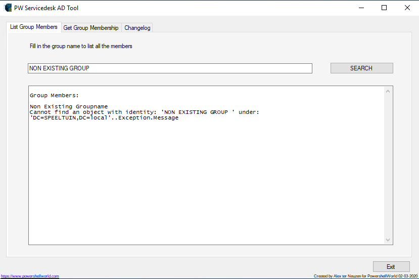
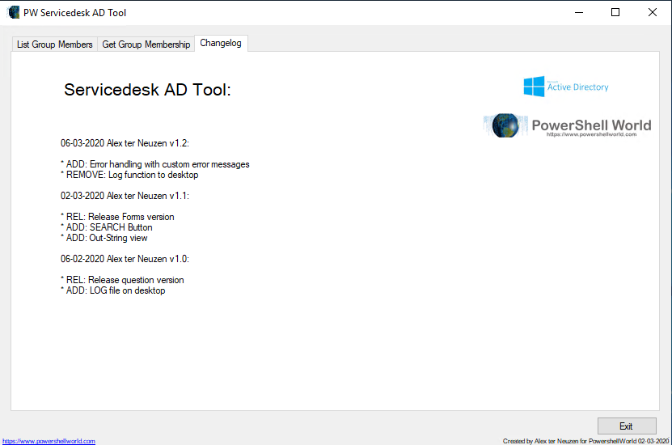

## Scripts - PW-Servicedesk-AD-Tool

Script special build for Servicedesk employees. 
It can be used in any domain. 
 
In the respository there is the PS1 and an executable to use.
 

## Changelog

06-03-2020 Alex ter Neuzen v1.2:

* ADD: Error handling with custom error messages
* REMOVE: Log function to desktop

02-03-2020 Alex ter Neuzen v1.1:

* REL: Release Forms version
* ADD: SEARCH Button
* ADD: Out-String view

06-02-2020 Alex ter Neuzen v1.0:

* REL: Release question version
* ADD: LOG file on desktop

## Screenshots

### Development

The development is still going on. 

### Final scripts

Once in a while there will be an update and the version number wil change.
